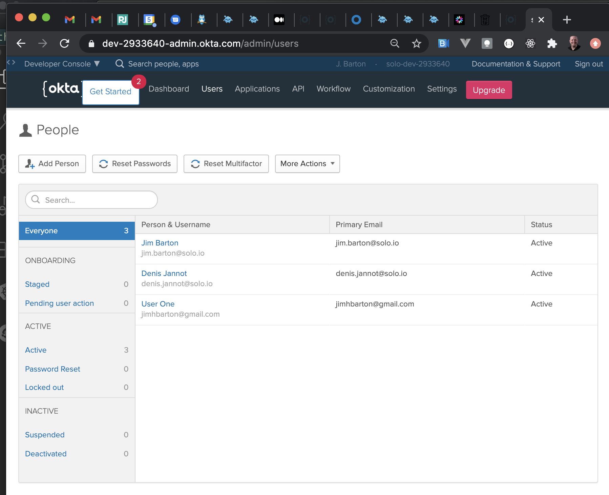
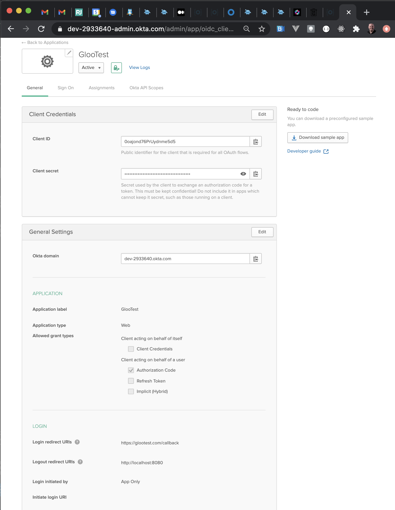
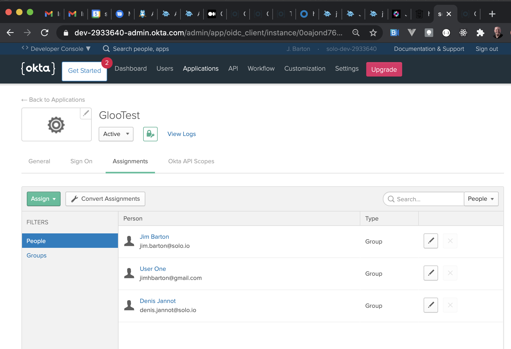
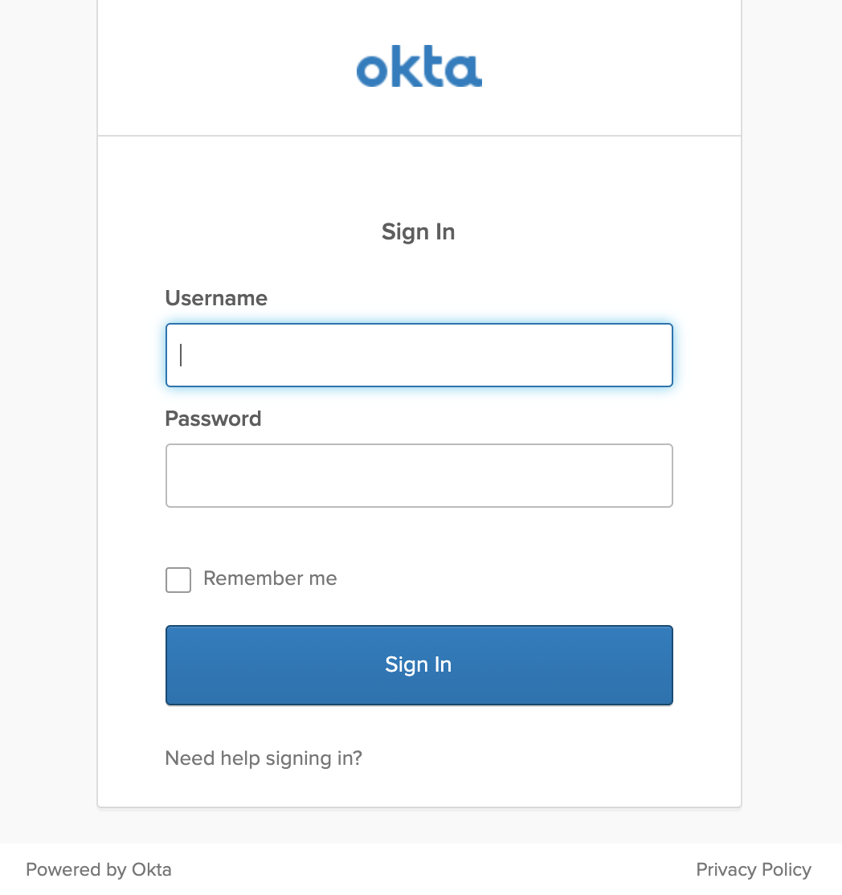
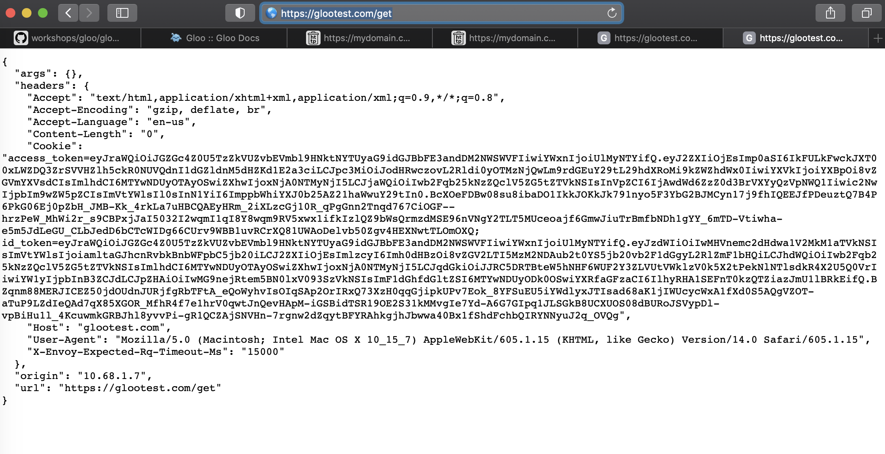
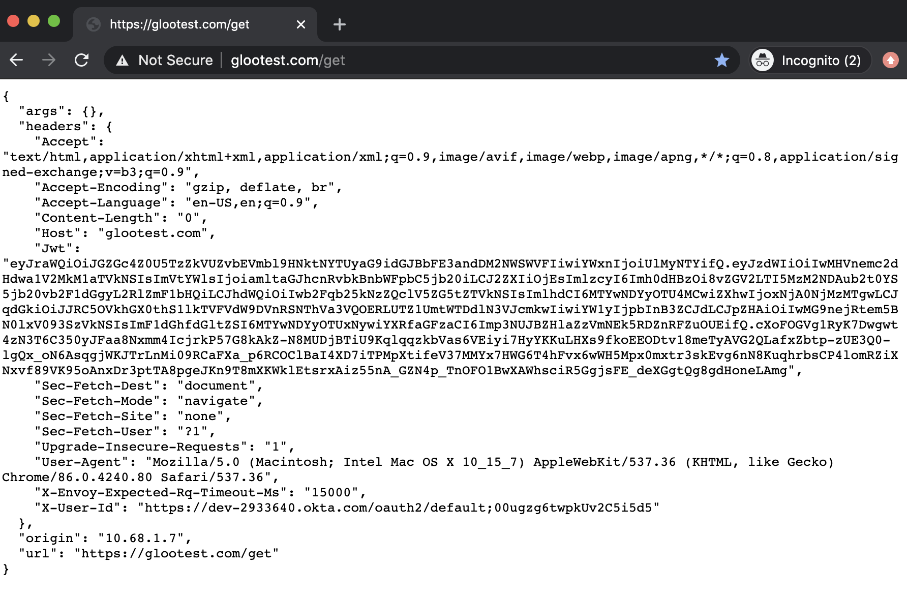
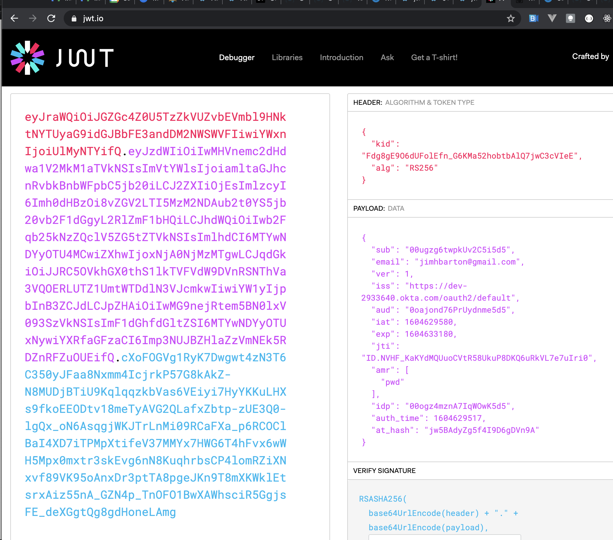
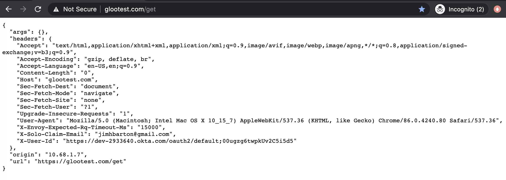

[Okta](https://okta.com) is an [OpenID Connect](https://openid.net) identity hub. Okta can be used to expose a consistent 
OpenID Connect interface to your applications while allowing your users to authenticate using credentials 
managed by Okta.

In this guide we will see how to authenticate users with your application via an OIDC flow that uses Okta as the identity 
provider. This guide is an example to get you started for test purposes with Okta.  It omits many of the factors that need to be considered for full production deployments.

First, we will use Gloo Edge to expose a simple [htpbin](https://httpbin.org/) Service running on Kubernetes.

Second, we’ll secure the access using Okta OIDC.  Okta will return a JWT token, and we’ll use Gloo Edge to extract some claims from this token create new headers corresponding to these claims.

Finally, we’ll see how Gloo Edge RBAC rules can be created to leverage the claims contained in the JWT token.

## Expose a Kubernetes Service

### Deploy the Service

Start by deploying the `httpbin` service on a Kubernetes cluster.  Use `kubectl` to apply the resources below to your cluster.  


This example was created and tested using a GKE cluster running k8s v1.16.13, but other platforms and versions should work as well.


```yaml
apiVersion: v1
kind: ServiceAccount
metadata:
  name: httpbin
---
apiVersion: v1
kind: Service
metadata:
  name: httpbin
  labels:
    app: httpbin
spec:
  ports:
  - name: http
    port: 8000
    targetPort: 80
  selector:
    app: httpbin
---
apiVersion: apps/v1
kind: Deployment
metadata:
  name: httpbin
spec:
  replicas: 1
  selector:
    matchLabels:
      app: httpbin
      version: v1
  template:
    metadata:
      labels:
        app: httpbin
        version: v1
    spec:
      serviceAccountName: httpbin
      containers:
      - image: docker.io/kennethreitz/httpbin
        imagePullPolicy: IfNotPresent
        name: httpbin
        ports:
        - containerPort: 80
```

### Verify the Upstream

Gloo Edge automatically discovers Kubernetes services automatically.  So, running the `glooctl get upstreams` command, you should be able to see a new Gloo Edge Upstream `default-httpbin-8000`, based on the naming convention `namespace-serviceName-portNumber`:

```shell
% glooctl get upstreams default-httpbin-8000
+----------------------+------------+----------+------------------------+
|       UPSTREAM       |    TYPE    |  STATUS  |        DETAILS         |
+----------------------+------------+----------+------------------------+
| default-httpbin-8000 | Kubernetes | Accepted | svc name:      httpbin |
|                      |            |          | svc namespace: default |
|                      |            |          | port:          8000    |
|                      |            |          |                        |
+----------------------+------------+----------+------------------------+
```

### Create the Virtual Service

Use `kubectl` to create the following Gloo Edge Virtual Service that will route all requests from domain `glootest.com` to the new Upstream.

```yaml
apiVersion: gateway.solo.io/v1
kind: VirtualService
metadata:
  name: httpbin-okta-vs
  namespace: gloo-system
spec:
  virtualHost:
    domains:
    - 'glootest.com'
    routes:
    - matchers:
      - prefix: /
      routeAction:
        single:
          upstream:
            name: default-httpbin-8000
            namespace: gloo-system
```

Run the following `glooctl` command to confirm that the new Route was accepted by Gloo Edge.

```shell
% glooctl get virtualservice httpbin-okta-vs
+-----------------+--------------+--------------+-----+----------+-----------------+----------------------------------+
| VIRTUAL SERVICE | DISPLAY NAME |   DOMAINS    | SSL |  STATUS  | LISTENERPLUGINS |              ROUTES              |
+-----------------+--------------+--------------+-----+----------+-----------------+----------------------------------+
| httpbin-okta-vs |              | glootest.com |     | Accepted |                 | / ->                             |
|                 |              |              |     |          |                 | gloo-system.default-httpbin-8000 |
|                 |              |              |     |          |                 | (upstream)                       |
+-----------------+--------------+--------------+-----+----------+-----------------+----------------------------------+
```

### Configure DNS and Test

Update your `/etc/hosts` file to resolve `glootest.com` by the IP address returned by the `glooctl proxy address` command (without the port number).

```shell
% glooctl proxy address
34.73.0.61:80

% tail -1 /etc/hosts
34.73.0.61 glootest.com
```

You can now access the application using the `glootest.com` domain.

```shell
% curl http://glootest.com/get
{
  "args": {},
  "headers": {
    "Accept": "*/*",
    "Content-Length": "0",
    "Host": "glootest.com",
    "User-Agent": "curl/7.64.1",
    "X-Envoy-Expected-Rq-Timeout-Ms": "15000"
  },
  "origin": "10.68.1.7",
  "url": "http://glootest.com/get"
}
```

Note that the `httpbin` service sends back information mirroring the request that we issued.

## Secure the application using HTTPS

In this section, we will begin securing the application by provisioning an https service endpoint.

For test purposes only, we'll begin by creating a self-signed certificate for the `glootest.com` domain.

```shell
% openssl req -x509 -nodes -days 365 -newkey rsa:2048 -keyout tls.key -out tls.crt -subj "/CN=glootest.com"
Generating a 2048 bit RSA private key
...+++
....+++
writing new private key to 'tls.key'
```

Second, we'll create a Kubernetes secret containing this certificate.

```shell
% kubectl create secret tls upstream-tls --key tls.key --cert tls.crt --namespace gloo-system
secret/upstream-tls created
```

Third, we enable HTTPS for our Virtual Service by using `kubectl` to apply the following change.


apiVersion: gateway.solo.io/v1
kind: VirtualService
metadata:
  name: httpbin-okta-vs
  namespace: gloo-system
spec:
  sslConfig:
    secretRef:
      name: upstream-tls
      namespace: gloo-system
  virtualHost:
    domains:
    - 'glootest.com'
    routes:
    - matchers:
      - prefix: /
      routeAction:
        single:
          upstream:
            name: default-httpbin-8000
            namespace: gloo-system


Finally, we will use `curl` to confirm that we can access the new https endpoint.

```shell
% curl -k https://glootest.com/get
{
  "args": {},
  "headers": {
    "Accept": "*/*",
    "Content-Length": "0",
    "Host": "glootest.com",
    "User-Agent": "curl/7.64.1",
    "X-Envoy-Expected-Rq-Timeout-Ms": "15000"
  },
  "origin": "10.68.1.7",
  "url": "https://glootest.com/get"
}
```

## Authenticate with Okta OIDC

In this section, we will establish an Okta account and application, then modify our Gloo Edge configuration to authenticate using Okta.

### Establish Okta Account

If you are an existing Okta customer, then this section is optional for you.  But even if you are not an established Okta customer, it is easy to establish a free developer account that allows you to complete the integration exercise outlined in this guide.  First, visit the [developer signup page](https://developer.okta.com/signup/) and walk through their process.  Okta then provisions a developer account that you can access via a URL like this:  https://dev-2933640-admin.okta.com/ .  This provides access to an account dashboard and tools to manage Okta applications and users.


### Establish Okta Users

For new developer accounts, you need to establish one or more Okta users for testing.  The simplest quickstart approach for adding new users is via the [console](https://developer.okta.com/docs/guides/quickstart/add-user/), although Okta offers other options as well.  A full description is beyond the scope of this guide, and we recommend you follow Okta's own [technical docs](https://developer.okta.com/docs/guides/) to find the best approach for your requirements.



### Establish Okta Application

You will need to establish an Okta application to integrate with Gloo Edge.  In this guide we prioritized providing a quickstart for testing over production readiness.  In establishing the Okta application from the dashboard wizard, we defined this as a `Web` type application and gave the application a name `GlooTest`.  Beyond that, we changed only one of the default settings from the new-application wizard: `Login redirect URIs`, for which we provided a single value `https://glootest.com/callback`.  For more details on creating `Web` type application integrations with Okta, we found [this guide](https://developer.okta.com/docs/guides/implement-auth-code/overview/) helpful.

Our final Okta `GlooTest` application profile looked like this.



Finally, ensure from the Okta application's Assignment tab that at least some of your Okta users have been assigned to your new application.



### Establish Gloo Edge AuthConfig for Okta App

In this section we will establish the oauth secret and an AuthConfig resource to connect Gloo Edge with the OIDC provider.  Be sure to have your Okta client ID and client secret ready, available from the Okta application profile page, under `Client Credentials`.

Create the oauth secret in Kubernetes using `glooctl` with the Okta application secret.

```shell
% glooctl create secret oauth --namespace gloo-system --name okta-client-secret --client-secret $CLIENT_SECRET
+--------------------+-------+
|       SECRET       | TYPE  |
+--------------------+-------+
| okta-client-secret | OAuth |
+--------------------+-------+
```

Create a Gloo Edge AuthConfig object to finish connecting the gateway to the OIDC provider.  Use `kubectl` to apply this change.

```yaml
apiVersion: enterprise.gloo.solo.io/v1
kind: AuthConfig
metadata:
  name: okta-oidc
  namespace: gloo-system
spec:
  configs:
  - oauth2:
      oidcAuthorizationCode:
        app_url: https://glootest.com
        callback_path: /callback
        client_id: <insert-your-app-client-id-here>
        client_secret_ref:
          name: okta-client-secret
          namespace: gloo-system
        issuer_url: https://dev-2933640.okta.com/oauth2/default
        scopes:
        - email
```

Note that we have used the `scopes` parameter to indicate to the identity provider to include the `email` of the user in the claims of the JWT token it will return.

Finally, use `kubectl` to update the Virtual Service to use Okta OIDC authentication:


apiVersion: gateway.solo.io/v1
kind: VirtualService
metadata:
  name: httpbin-okta-vs
  namespace: gloo-system
spec:
  sslConfig:
    secretRef:
      name: upstream-tls
      namespace: gloo-system
  virtualHost:
    domains:
    - 'glootest.com'
    routes:
    - matchers:
      - prefix: /
      routeAction:
        single:
          upstream:
            name: default-httpbin-8000
            namespace: gloo-system
    options:
      extauth:
        configRef:
          name: okta-oidc
          namespace: gloo-system


Note that the `/callback` path will be handled by this same Virtual Service because we used a catch-all `/` prefix matcher.

### Verify Okta Integration


The examples in this guide were tested using both Safari and Chrome on MacOS.  You may experience some issues in development mode due to the use of self-signed certificates.  These present as 403 Forbidden errors, possibly with an `ERR_CERT_INVALID` error code.  With Safari, you can work through this by clicking through advanced settings and indicating you understand the risks.  With Chrome, you may need to use the `thisisunsafe` workaround described [here](https://medium.com/@dblazeski/chrome-bypass-net-err-cert-invalid-for-development-daefae43eb12).

You may also experience browser issues if there is an overlap between the email of your Okta user and an active Google oauth connection in your browser.  Issuing these requests in Incognito (Chrome) or Private (Safari) windows resolves these problems.

In any event, particularly when establishing an initial connection, you may need to issue the https://glootest.com/get request more than once.  If this occurs, be sure to re-issue the https://glootest.com/get request and not the https://glootest.com/callback... request.


We will now confirm that the initial Okta integration using a web browser.  First, navigate to https://glootest.com.  You should be redirected to the Okta Login page.  Sign in as one of your configured Okta users who is authorized for this application.



Gloo Edge has redirected you to the `/callback` endpoint we configured in the AuthConfig, with the information it got from Okta OIDC added as a query string to create a Cookie.  This cookie contains both an `access_token` and an `id_token` from Okta.  The `id_token` is a JWT from which we will extract claims to drive fine-grained RBAC decisions later in this exercise.  

After this callback, the normal request flow continues and the upstream application responds.  You should get output that looks something like below.  In particular, note the `Cookie` header supplied by Okta containing both an `access_token` and an `id_token`.



You can also test other `httpbin` endpoints via the Gloo Edge gateway.  For example, consider this base64 conversion service endpoint:  https://mydomain.com/base64/R2xvbyBpcyBhd2Vzb21lCg==


## JWT Claim Extraction

The `id_token` contains a [JWT](https://jwt.io/) from which we can extract claims that may be useful in driving downstream RBAC policies.  In this section, we will enhance our Virtual Service by applying a transformation.  

### Transform Okta Cookie to JWT Header

It will use a regular expression to extract the JWT token from the Cookie header.  Then it will create a new `Jwt` header containing the token.  Finally, we will remove the cookie header from the request.

Apply these transformation changes to the Gloo Edge Virtual Service.


apiVersion: gateway.solo.io/v1
kind: VirtualService
metadata:
  name: httpbin-okta-vs
  namespace: gloo-system
spec:
  sslConfig:
    secretRef:
      name: upstream-tls
      namespace: gloo-system
  virtualHost:
    domains:
    - 'glootest.com'
    routes:
    - matchers:
      - prefix: /
      routeAction:
        single:
          upstream:
            name: default-httpbin-8000
            namespace: gloo-system
    options:
      extauth:
        configRef:
          name: okta-oidc
          namespace: gloo-system
      stagedTransformations:
        early:
          requestTransforms:
          - requestTransformation:
              transformationTemplate:
                extractors:
                  token:
                    header: 'cookie'
                    regex: '.*id_token=([^;]*).*'
                    subgroup: 1
                headers:
                  jwt:
                    text: '{{ token }}'
      headerManipulation:
        requestHeadersToRemove:
        - "cookie"


Below is the type of output you should see when you refresh the web page.  Note that the `Cookie` header has been replaced by a `Jwt` header.



If we paste the contents of the `Jwt` header into the JWT decoder at jwt.io, we can see some of the JWT claims that are available for us to make routing and authorization decisions.  In particular, note the `email` claim that we specified in the AuthConfig resource.



### Convert JWT to Request Header

In this section, we will use JWKS (JSON Web Key Set) to transform the JWT we extracted from the Okta callback into a specific `email` header that can drive fine-grained authorization decisions.  Okta publishes a read-only JWKS endpoint where public keys can be extracted that allow us to decode our JWT and then place its claims into request headers.  Details about how Okta publishes its JWKS keys is available [here](https://developer.okta.com/docs/guides/validate-id-tokens/overview/).

First, we need to specify a Gloo Edge Upstream that exposes the JWKS endpoint that Okta publishes for our development account.  Use `kubectl` to apply this Upstream to our cluster.

```yaml
apiVersion: gloo.solo.io/v1
kind: Upstream
metadata:
  name: okta-jwks
  namespace: gloo-system
spec:
  static:
    hosts:
      # This upstream identifies the host where Okta publishes the JWKS endpoint for my dev account
      # See https://dev-2933640-admin.okta.com/oauth2/default/.well-known/oauth-authorization-server
      - addr: dev-2933640.okta.com
        port: 443
```

Next, we will update our Virtual Service to use the JWKS upstream to decode the JWT and convert the `email` claim to a custom header `x-solo-claim-email`.  Apply these changes using `kubectl`.


apiVersion: gateway.solo.io/v1
kind: VirtualService
metadata:
  name: httpbin-okta-vs
  namespace: gloo-system
spec:
  sslConfig:
    secretRef:
      name: upstream-tls
      namespace: gloo-system
  virtualHost:
    domains:
    - 'glootest.com'
    routes:
    - matchers:
      - prefix: /
      routeAction:
        single:
          upstream:
            name: default-httpbin-8000
            namespace: gloo-system
    options:
      extauth:
        configRef:
          name: okta-oidc
          namespace: gloo-system
      stagedTransformations:
        early:
          requestTransforms:
          - requestTransformation:
              transformationTemplate:
                extractors:
                  token:
                    header: 'cookie'
                    regex: '.*id_token=([^;]*).*'
                    subgroup: 1
                headers:
                  jwt:
                    text: '{{ token }}'
      headerManipulation:
        requestHeadersToRemove:
        - "cookie"
      jwt:
        providers:
          okta:
            issuer: https://dev-2933640.okta.com/oauth2/default
            tokenSource:
              headers:
              - header: Jwt
            claimsToHeaders:
            - claim: email
              header: x-solo-claim-email
            jwks:
              remote:
                url: https://dev-2933640.okta.com/oauth2/default/v1/keys
                upstreamRef:
                  name: okta-jwks
                  namespace: gloo-system


Refreshing the web page yields output like the following.  Note in particular that the `Jwt` header is removed and has been replaced by the `X-Solo-Claim-Email` header, whose contents match the `email` claim in the JWT from the Okta callback.



## Driving RBAC Decisions Using JWT Claims

In this section, we will use the `email` user identity extracted from the JWT to drive authorization decisions.  Let's apply it to a simple use case where we only want to allow the `jimhbarton@gmail.com` to have access to the httpbin `/get` endpoint but no others.

Apply the following change to your cluster using `kubectl`.


apiVersion: gateway.solo.io/v1
kind: VirtualService
metadata:
  name: httpbin-okta-vs
  namespace: gloo-system
spec:
  sslConfig:
    secretRef:
      name: upstream-tls
      namespace: gloo-system
  virtualHost:
    domains:
    - 'glootest.com'
    routes:
    - matchers:
      - prefix: /
      routeAction:
        single:
          upstream:
            name: default-httpbin-8000
            namespace: gloo-system
    options:
      extauth:
        configRef:
          name: okta-oidc
          namespace: gloo-system
      stagedTransformations:
        early:
          requestTransforms:
          - requestTransformation:
              transformationTemplate:
                extractors:
                  token:
                    header: 'cookie'
                    regex: '.*id_token=([^;]*).*'
                    subgroup: 1
                headers:
                  jwt:
                    text: '{{ token }}'
      headerManipulation:
        requestHeadersToRemove:
        - "cookie"
      jwt:
        providers:
          okta:
            issuer: https://dev-2933640.okta.com/oauth2/default
            tokenSource:
              headers:
              - header: Jwt
            claimsToHeaders:
            - claim: email
              header: x-solo-claim-email
            jwks:
              remote:
                url: https://dev-2933640.okta.com/oauth2/default/v1/keys
                upstreamRef:
                  name: okta-jwks
                  namespace: gloo-system
      rbac:
        policies:
          viewer:
            permissions:
              methods:
              - GET
              pathPrefix: /get
            principals:
            - jwtPrincipal:
                claims:
                  email: jimhbarton@gmail.com


If authenticated using the `email` in the `rbac` policy, the `https://glootest.com/get` endpoint will respond in the web browser exactly as before.  However, authenticating as a different user or exercising a different endpoint will result in an `access denied` error like this.


